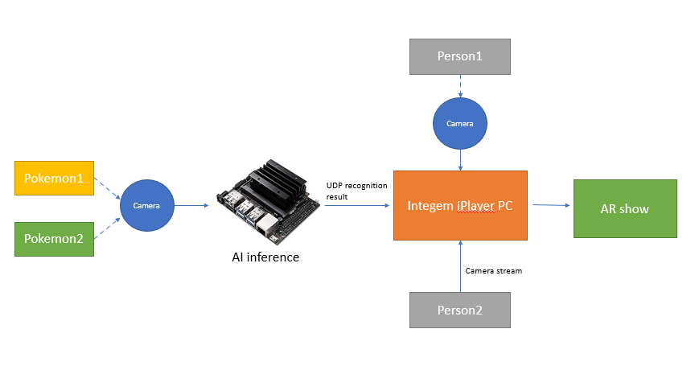

# Pokemon-AI-Nvidia-Nano-Project
This project uses Nvidia Nano to inference AI detection model and play it in Integem iPlayer

**Table of contents**
- [What does it do](#what-does-it-do)
- [Targets and Usage Instructions](#targets)
- [References](#references)

## What does it do

This project integrates Nvidia Nano AI inference capability with Integem Holographic AR product. After training detection model for 5 pokemons, we use it for a pokemon AR match game. Two persons play this game in a virtual world to show their pokemon in real-time. AI will recognize the pokemon and show the winner of the game.

## Targets and Usage Instructions

1. data:

  Five different pokemon data is located at /nvidia_nano_program/data/pokemon3. These data are taken by using nvidia "camera-capture" program 
  
2. train:

  We retrained mobilenet V1 model by using above data. The training script is located nvidia_nano_program/train_ssd.py. Please follow the direction from Jetson AI Fundamentals - S3E5 - Training Object Detection Models (https://www.youtube.com/watch?v=2XMkPW_sIGg&list=PL5B692fm6--uQRRDTPsJDp4o0xbzkoyf8&index=14). Due to the limited processing power of Nano 2GB, it may take very long time to complete the retraining with Nano 2GB. We retrained the model by using Doecker Desktop in Windows PC WSL2, which takes much shorter time to complete training.
  
3. evaluate:

  We evaluated the re-trained model by using "detectnet.py". Please follow the direction from Jetson AI Fundamentals - S3E5 - Training Object Detection Models as shown above.
  
4. inference:

  We inference the re-trained model and send the results to integem AR system through UDP message. The script is located at nvidia_nano_program/detectnet_myModel_network5.py. However, the docker imaged provided in the video tutorial can not assess network environment. So we needs to rebuild the project from source. Please follow the direction from https://github.com/dusty-nv/jetson-inference/blob/master/docs/building-repo-2.md

5. Integem iCreator and iPlayer program:
   Integem iCreator and iPlayer program are used to demo this project in holographic AR world. The program can be downloaaded from https://www.integem.com/download/. First please download "idownloader" and contact integem to apply for user account. After login, you can download iCreator and iPlayer program.
   This pokemon match game AR project is located at integem_iCreator_program/pokemon_ai_game_v5. The python related programs is located at integem_iCreator_program/pokemon_ai_game_v5/script/

6. test:

  First run "python3 detectnet_myModel_network5.py" in Nvidia nano with a USB camera. A pop-up window will show the recognized pokemans. In order to play pokemon game, place one pokemon at the left side of camera and the other one at the right side of camera. In another windows pc, run iPlayer program for pokemon_ai_game_v5 project. PLease modifiy the ip address accordingly in python3 detectnet_myModel_network5.py and initial_setup.py at integem_iCreator_program/pokemon_ai_game_v5/script.
  
7. Additional

  In Integem iPlayer program, one can invite another person to join the Holographic AR game and make it more fun. 
  

## References

- This work heavily relies on Nvidia hello AI World : https://github.com/dusty-nv/jetson-inference

- This work also depends on Integem iCreator and iPlayer for AR demo: https://www.integem.com/

